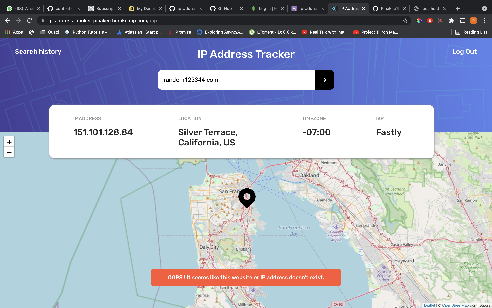
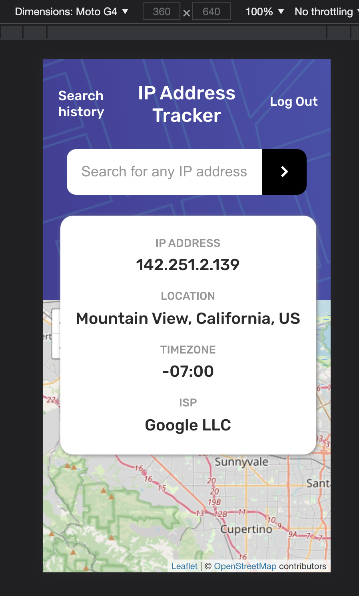

# IP address tracker

## Table of contents

- [Overview](#overview)
  - [The challenge](#the-challenge)
  - [App Structure](#folder-structure)
  - [Links](#links)
- [My process](#my-process)
  - [Built with](#built-with)

## Overview

### The challenge

Users should be able to:

- Login using SAWO sdk (the passwordless way)
- View the optimal layout for each page depending on their device's screen size
- See hover states for all interactive elements on the page
- See their own IP address on the map on the initial page load
- Search for any IP addresses or domains and see the key information and location

### App Structure

#### public
#### src
  ##### - assets
  ##### - auth
  ##### - components
  ##### - layout
  ##### - services
  ##### - utils

## Screenshot

- ### **WEB VIEW**
- App Login Page:
  
-- Landing Web app view:
  
- Web app view after feeding value:
  
- Web app view on loading:
  
- Web app view on wrong Inputs:
  
  

- ### **MOBILE VIEW**

- Mobile Login View.
  
- Mobile landing view.
  
- Mobile view after feeding value 
  

### Links

- Solution Site URL:
  - [Front-end](https://github.com/Pinakee15/ip-address-tracker-app)
- Live Site URL: [App Link](https://ip-address-tracker-pinakee.herokuapp.com)

## My process

### Built with
- HTML CSS
- [React](https://reactjs.org/) - JS library
- [React router](https://reactrouter.com/) React supporting routing library
- [Sawo SDK](https://sawolabs.com/) - Passwordless Authentication SDK
- [IP Geolocation API](https://geo.ipify.org/) - Geolocation of an IP address finder api
- [Leaftlet](https://leafletjs.com/) - Mapping Library
- [React Leaflet](https://react-leaflet.js.org/) - React components for Leaflet
- [Axios](https://axios-http.com/) - Promise based HTTP client library
- Flexbox - For structuring html elements along x or y axis
- Media Query - For responsive mobile app view
